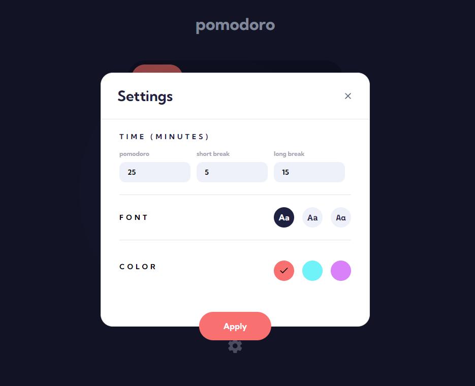

# Frontend Mentor - Multi-step form solution

This is a solution to the Multi-step form challenge on Frontend Mentor. Frontend Mentor challenges help you improve your coding skills by building realistic projects.

## Table of contents

- [Overview](#overview)
  - [The challenge](#the-challenge)
  - [Screenshot](#screenshot)
  - [Links](#links)
- [My process](#my-process)
  - [Built with](#built-with)
  - [What I learned](#what-i-learned)
- [Author](#author)

## Overview

### The challenge

Users should be able to:

- Set a Pomodoro timer and short & long break timers
- Customize how long each timer runs for
- See a circular progress bar that updates every minute and represents how far through their timer they are
- Customize the appearance of the app with the ability to set preferences for colors and fonts

### Screenshot

<p align="center" >
    
    
    
    
</p>

### Links

- [Live Site](https://pomodoro-app-one-alpha.vercel.app/)

## My process

### Built with

- [React](https://reactjs.org/) - JS library
- [Tailwindcss](https://tailwindcss.com/) - For styles
- Typescript

### What I learned

Tailwindcss doesn't work well with dynamic class names. Since in this application elements can change from 3 differente colors (red, cyan and purple) based on user choice, I was using dynamic classes to create the effect.

```html
<div className="{`bg-accent_${color}" ...`}></div>
```

While it didn't work at first, just putting the color name instead of the variable and then changing it back would work somehow. But to actually fix this issue, I couldn't use dynamic classes like this, but instead, complete classes.

One way to allow the user to choose between the 3 colors while using tailwindcss, was to map the color prop to static class names.

```typescript
const colorVariants = {
  red: "bg-accent_red",
  cyan: "bg-accent_cyan",
  purple: "bg-accent_purple",
  blue: "bg-blue",
  input_color: "bg-input_color",
};

<div
  className={`
        ${colorVariants[color as keyof typeof colorVariants]} 
        ...
    `}
></div>;
```

This way, I can access the whole class using the color name to be used, and have no problems with tailwindcss.

You can read more about it at the [tailwind documentation](https://tailwindcss.com/docs/content-configuration#dynamic-class-names)

## Author

- Frontend Mentor - [@yan-batista](https://www.frontendmentor.io/profile/yan-batista-1326)
- Github - [@yan-batista](https://github.com/yan-batista)
